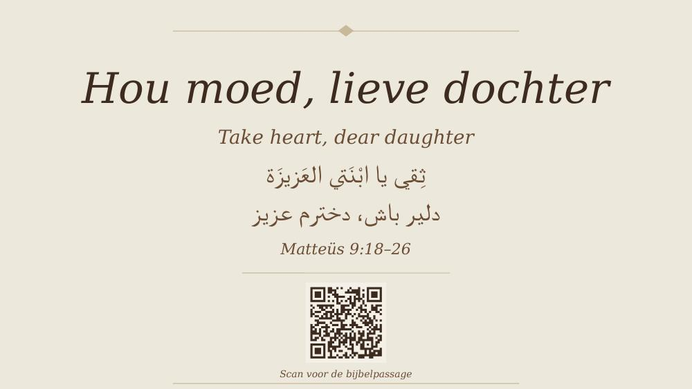

# Stijl aanpassen

De standaardstijl is **parchment**: warme beige achtergronden, donkerbruine tekst, Georgia-lettertype, subtiele schaduwen. Dit past goed bij een kerkelijke context en werkt met alle talen.

## Een andere stijl gebruiken

Heb je een voorbeeld van een stijl die je mooi vindt? Geef het als afbeelding aan Claude tijdens het gesprek. Bijvoorbeeld:

- Een screenshot van een andere presentatie
- Een foto van een boekomslag
- Een webpagina die je aanspreekt
- Een kunstwerk of schilderij

Claude zal de kleuren en sfeer uit je voorbeeld overnemen en toepassen op je preekpakket. Je kunt het zo vragen:

> *"Kan de stijl lijken op deze afbeelding? Ik wil graag donkerdere tinten met meer rood."*

## Wat kan Claude voor stijl aanpassen?

Aanpasbaar:

- De kleurenpaletten (achtergrond, randen, tekstkleur, accenten)
- De sfeer (warm, koel, klassiek, modern)

Niet aanpasbaar:

- **Lettertype voor Arabisch: altijd "Traditional Arabic"**
- **Lettertype voor Farsi: altijd "Arabic Typesetting"**
- **Rechts-naar-links leesrichting voor Arabisch en Farsi**

Deze beperkingen zijn er om ervoor te zorgen dat de presentatie op elke computer (Windows, Mac) goed blijft renderen en leesbaar blijft voor Arabisch- en Farsi-sprekers.

## Wat als ik een heel andere lay-out wil?

Het standaardformat (titel, bijbelteksten, overzicht, punten) is vrij vast. Als je iets heel anders wilt — bijvoorbeeld een narratieve opbouw, of meer dia's per punt — bespreek dat dan met Claude aan het begin van het gesprek. Claude kan de scripts aanpassen voor jouw specifieke preek, maar die aanpassingen zijn dan niet standaard bewaard in het kit.

## Tip: consistent houden binnen HVV

Als gemeente wint het als de preekpakketten op elkaar lijken. We raden aan om de parchment-stijl te gebruiken tenzij er een goede reden is om af te wijken. Zo herkennen bezoekers de stijl en weten ze: dit is van HVV.
